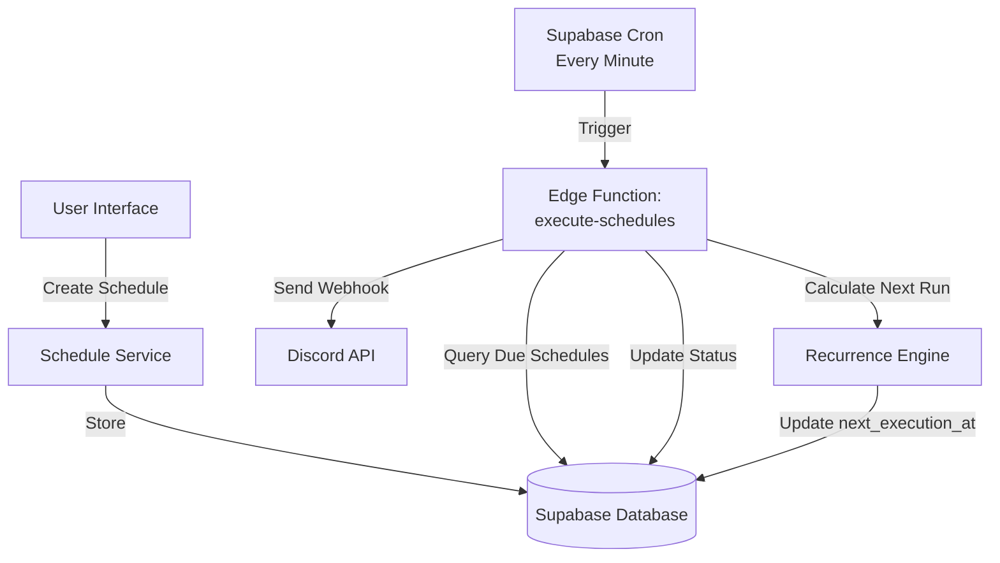

# Quick Start Guide - Recurring Schedules

This guide will help you quickly implement the recurring schedules feature in Discord Lab.

## Overview

You're experiencing two issues:
1. **"Failed to save schedule" error** - The old [`ScheduleForm.tsx`](../components/ScheduleForm.tsx) doesn't match the newer [`scheduleService.ts`](../lib/scheduleService.ts) API
2. **One-time execution only** - No recurring schedule support exists yet

This implementation adds:
- ✅ Recurring schedules (daily, weekly, monthly, custom cron)
- ✅ Natural language input ("every Monday at 9 AM")
- ✅ Backend execution via Supabase Edge Functions
- ✅ Proper schedule tracking and management
- ✅ File attachment support

## Implementation Order

Follow these steps in order:

### 1. Database Migration (15 minutes)

**File**: [`docs/DATABASE_MIGRATION.md`](./DATABASE_MIGRATION.md)

1. Backup your production database
2. Run the migration SQL in Supabase SQL Editor
3. Verify with the provided verification queries

**Key Changes**:
- Adds `is_recurring`, `recurrence_pattern`, `recurrence_config` columns
- Adds `next_execution_at` for tracking
- Creates indexes for performance
- Sets up storage bucket for files

### 2. TypeScript Types (30 minutes)

**File**: [`docs/IMPLEMENTATION_GUIDE.md`](./IMPLEMENTATION_GUIDE.md) - Section: TypeScript Types

1. Create `lib/types/schedule.ts` with new types
2. Update `lib/scheduleService.ts` to use new types
3. Update `lib/webhookSerializer.ts` if needed

**Key Types**:
- `RecurrencePattern`: 'once' | 'daily' | 'weekly' | 'monthly' | 'custom'
- `RecurrenceConfig`: Configuration for each pattern type
- Extended `ScheduleRow` with recurrence fields

### 3. Cron Parser Utility (45 minutes)

**File**: [`docs/IMPLEMENTATION_GUIDE.md`](./IMPLEMENTATION_GUIDE.md) - Section: Cron Parser

1. Create `lib/cronParser.ts`
2. Implement natural language parsing
3. Add cron validation
4. Create preset schedules

**Features**:
- Parse "every Monday at 9 AM" → weekly config
- Parse "daily at 2:30 PM" → daily config
- Validate cron expressions
- Provide common presets

### 4. Update Schedule Service (30 minutes)

**File**: [`docs/IMPLEMENTATION_GUIDE.md`](./IMPLEMENTATION_GUIDE.md) - Section: Schedule Service

1. Update `createSchedule()` to accept recurrence params
2. Update `updateSchedule()` similarly
3. Add `calculateNextExecution()` function
4. Add `shouldContinueExecution()` helper

### 5. UI Components (1-2 hours)

**File**: [`docs/IMPLEMENTATION_GUIDE.md`](./IMPLEMENTATION_GUIDE.md) - Section: UI Components

1. Create `components/RecurrenceSelector.tsx`
2. Update `components/ScheduleForm.tsx` to use `scheduleService`
3. Update `components/webhook/ScheduleManager.tsx` for recurrence
4. Add pattern-specific config components

**UI Features**:
- Toggle between one-time and recurring
- Natural language input field
- Pattern-specific configuration (days, time, etc.)
- Preview of parsed schedule

### 6. Edge Function (1 hour)

**File**: [`docs/IMPLEMENTATION_GUIDE.md`](./IMPLEMENTATION_GUIDE.md) - Section: Edge Function

1. Create `supabase/functions/execute-schedules/index.ts`
2. Implement schedule fetching and execution
3. Add recurrence calculation logic
4. Handle file attachments
5. Deploy to Supabase

**Function Logic**:
- Query schedules where `next_execution_at <= NOW()`
- Send webhook to Discord
- Update `execution_count` and `last_executed_at`
- Calculate and set new `next_execution_at` for recurring
- Deactivate completed schedules

### 7. Configure Cron Job (5 minutes)

In Supabase Dashboard:
1. Go to Database > Cron Jobs
2. Create new job: `execute-scheduled-webhooks`
3. Schedule: `* * * * *` (every minute)
4. HTTP POST to your Edge Function
5. Enable the job

### 8. Testing (1-2 hours)

**File**: [`docs/TESTING_AND_DEPLOYMENT.md`](./TESTING_AND_DEPLOYMENT.md)

Follow the comprehensive testing checklist:
- Test one-time schedules
- Test each recurring pattern (daily, weekly, monthly)
- Test natural language parsing
- Test file attachments
- Test edge cases (timezones, DST, etc.)

### 9. Deploy to Production (30 minutes)

**File**: [`docs/TESTING_AND_DEPLOYMENT.md`](./TESTING_AND_DEPLOYMENT.md) - Section: Deployment Steps

1. Run database migration on production
2. Deploy Edge Function
3. Configure production cron job
4. Deploy frontend updates
5. Monitor first executions

## Quick Fix for Immediate Issue

If you just want to fix the "Failed to save schedule" error without adding recurring schedules yet:

### Option A: Use ScheduleManager Component

The [`ScheduleManager.tsx`](../components/webhook/ScheduleManager.tsx) component already uses the proper `scheduleService`. Replace your current schedule form with this component.

### Option B: Fix ScheduleForm.tsx

Update [`ScheduleForm.tsx`](../components/ScheduleForm.tsx:107-154) to use `scheduleService`:

```typescript
import { createSchedule } from '@/lib/scheduleService'
import { snapshotFromBuilder } from '@/lib/webhookSerializer'

const handleSchedule = async (e: React.FormEvent) => {
  e.preventDefault()
  if (!user || !profile) return

  setLoading(true)
  try {
    // Create snapshot from form data
    const snapshot = {
      content: data.message,
      username: data.username || '',
      avatarUrl: data.avatarUrl || '',
      threadName: '',
      suppressEmbeds: false,
      suppressNotifications: false,
      embeds: [],
      files: []
    }

    await createSchedule({
      supabase,
      userId: user.id,
      name: data.name,
      webhookUrl: data.webhookUrl,
      scheduleTime: data.scheduleTime,
      snapshot,
      files: [], // Add file support later
      isRecurring: false, // One-time only for now
      recurrencePattern: 'once'
    })

    toast.success('Schedule created successfully!')
    onSuccess()
  } catch (error) {
    console.error('Error creating schedule:', error)
    toast.error('Failed to save schedule')
  } finally {
    setLoading(false)
  }
}
```

## Architecture Diagram



## File Structure

After implementation, your project will have:

```
Discord-Lab/
├── lib/
│   ├── types/
│   │   └── schedule.ts          # NEW: Type definitions
│   ├── cronParser.ts             # NEW: Natural language parser
│   ├── scheduleService.ts        # UPDATED: Add recurrence support
│   └── webhookSerializer.ts      # Existing
├── components/
│   ├── RecurrenceSelector.tsx    # NEW: Recurrence UI
│   ├── ScheduleForm.tsx          # UPDATED: Use scheduleService
│   └── webhook/
│       └── ScheduleManager.tsx   # UPDATED: Add recurrence
├── supabase/
│   └── functions/
│       └── execute-schedules/
│           ├── index.ts          # NEW: Main function
│           └── recurrence.ts     # NEW: Calculation logic
└── docs/
    ├── SCHEDULE_SYSTEM_ARCHITECTURE.md
    ├── DATABASE_MIGRATION.md
    ├── IMPLEMENTATION_GUIDE.md
    ├── TESTING_AND_DEPLOYMENT.md
    └── QUICK_START.md            # This file
```

## Common Pitfalls

1. **Timezone Issues**: Always store times in UTC, convert for display
2. **Cron Frequency**: Don't run more than once per minute (rate limits)
3. **File Cleanup**: Remember to delete files from storage when schedule deleted
4. **RLS Policies**: Ensure users can only access their own schedules
5. **Service Role Key**: Keep it secure, never expose in frontend

## Support & Resources

- **Architecture**: [`SCHEDULE_SYSTEM_ARCHITECTURE.md`](./SCHEDULE_SYSTEM_ARCHITECTURE.md)
- **Database**: [`DATABASE_MIGRATION.md`](./DATABASE_MIGRATION.md)
- **Implementation**: [`IMPLEMENTATION_GUIDE.md`](./IMPLEMENTATION_GUIDE.md)
- **Testing**: [`TESTING_AND_DEPLOYMENT.md`](./TESTING_AND_DEPLOYMENT.md)

## Estimated Time

- **Quick Fix Only**: 30 minutes
- **Full Implementation**: 6-8 hours
- **Testing & Deployment**: 2-3 hours
- **Total**: 8-11 hours

## Next Steps

1. Review the architecture document
2. Run database migration in development
3. Implement TypeScript types
4. Build cron parser utility
5. Update UI components
6. Create Edge Function
7. Test thoroughly
8. Deploy to production

Good luck! 🚀