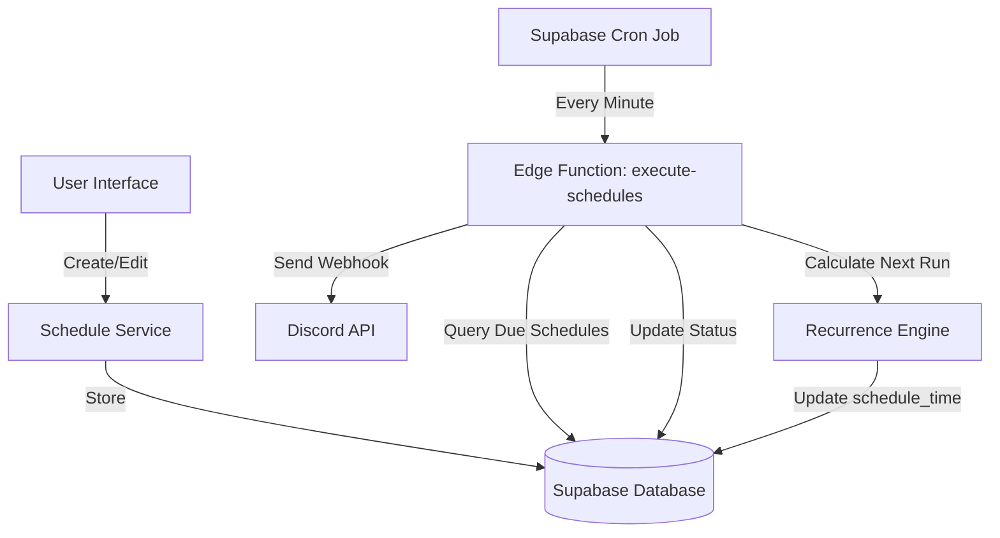

# Schedule System Architecture & Implementation Plan

## Current Issues Analysis

### 1. "Failed to save schedule" Error
**Root Cause**: [`ScheduleForm.tsx`](../components/ScheduleForm.tsx:107-154) uses a simplified direct database insert that doesn't match the schema expected by [`scheduleService.ts`](../lib/scheduleService.ts:95-140).

**Problems**:
- Missing `builder_state` field (required for rich webhook builder data)
- No file attachment handling
- Doesn't use the proper service layer
- Incompatible with the newer [`ScheduleManager.tsx`](../components/webhook/ScheduleManager.tsx) component

### 2. One-Time Execution Only
**Current Behavior**: 
- Schedules store a single `schedule_time` timestamp
- After execution, `is_active` is set to `false`
- No recurrence pattern support
- No cron-like scheduling

### 3. Missing Backend Execution
**Critical Gap**: No actual webhook execution system exists
- Schedules are saved to database but never executed
- README mentions Edge Function and cron, but they're not implemented
- No worker process to check and execute due schedules

## Proposed Solution Architecture

### System Overview



### Database Schema Design

#### Updated `schedules` Table

```sql
CREATE TABLE public.schedules (
  id UUID DEFAULT gen_random_uuid() PRIMARY KEY,
  user_id UUID REFERENCES public.profiles(id) ON DELETE CASCADE,
  name TEXT NOT NULL,
  webhook_url TEXT NOT NULL,
  message_data JSONB NOT NULL,
  builder_state JSONB,
  files JSONB,
  
  -- Scheduling fields
  schedule_time TIMESTAMP WITH TIME ZONE NOT NULL,
  is_recurring BOOLEAN DEFAULT false,
  recurrence_pattern TEXT, -- 'once', 'daily', 'weekly', 'monthly', 'custom'
  cron_expression TEXT, -- Standard cron format for custom patterns
  recurrence_config JSONB, -- Additional config: day_of_week, day_of_month, time, etc.
  
  -- Execution tracking
  is_active BOOLEAN DEFAULT true,
  last_executed_at TIMESTAMP WITH TIME ZONE,
  next_execution_at TIMESTAMP WITH TIME ZONE,
  execution_count INTEGER DEFAULT 0,
  max_executions INTEGER, -- NULL for unlimited
  
  -- Metadata
  created_at TIMESTAMP WITH TIME ZONE DEFAULT NOW(),
  updated_at TIMESTAMP WITH TIME ZONE DEFAULT NOW()
);

-- Index for efficient cron queries
CREATE INDEX idx_schedules_next_execution 
  ON public.schedules(next_execution_at) 
  WHERE is_active = true;
```

### Recurrence Pattern System

#### Pattern Types

1. **One-Time** (`once`)
   - Execute once at specified time
   - Set `is_active = false` after execution

2. **Daily** (`daily`)
   - Execute every day at specified time
   - Config: `{ time: "14:30" }`

3. **Weekly** (`weekly`)
   - Execute on specific days of week
   - Config: `{ days: [1, 3, 5], time: "09:00" }` (Mon, Wed, Fri)

4. **Monthly** (`monthly`)
   - Execute on specific day of month
   - Config: `{ day: 15, time: "12:00" }` (15th of each month)

5. **Custom** (`custom`)
   - Full cron expression support
   - Example: `0 9 * * 1-5` (9 AM on weekdays)

#### Natural Language Support

Users can input patterns like:
- "Every Monday at 9 AM"
- "Daily at 2:30 PM"
- "Every weekday at 8 AM"
- "First day of every month at noon"
- "Every 6 hours"

Parser will convert to appropriate pattern + config.

### TypeScript Type System

```typescript
// Recurrence types
export type RecurrencePattern = 'once' | 'daily' | 'weekly' | 'monthly' | 'custom'

export type RecurrenceConfig = {
  // For daily
  time?: string // "HH:mm" format
  
  // For weekly
  days?: number[] // 0-6, where 0 is Sunday
  
  // For monthly
  day?: number // 1-31
  
  // For custom
  cronExpression?: string
  
  // Common
  timezone?: string // User's timezone
}

export type ScheduleRow = {
  id: string
  user_id: string
  name: string
  webhook_url: string
  message_data: WebhookMessagePayload
  builder_state?: BuilderStateSnapshot
  files?: StoredFileAttachment[]
  
  // Scheduling
  schedule_time: string
  is_recurring: boolean
  recurrence_pattern?: RecurrencePattern
  cron_expression?: string
  recurrence_config?: RecurrenceConfig
  
  // Execution tracking
  is_active: boolean
  last_executed_at?: string
  next_execution_at?: string
  execution_count: number
  max_executions?: number
  
  // Metadata
  created_at: string
  updated_at: string
}
```

### UI Components Architecture

#### 1. Schedule Type Toggle
```
[ One-Time ]  [ Recurring ]
```

#### 2. One-Time Schedule UI
```
Schedule Name: [________________]
Date & Time:   [2025-10-05] [14:30]
```

#### 3. Recurring Schedule UI
```
Schedule Name: [________________]
Pattern:       [Dropdown: Daily/Weekly/Monthly/Custom]

[Pattern-specific fields appear here]

Start Date:    [2025-10-05]
Start Time:    [14:30]
End After:     [ ] Never  [ ] After [__] executions
```

#### 4. Pattern-Specific Fields

**Daily:**
```
Time: [14:30]
```

**Weekly:**
```
Days: [x] Mon [x] Wed [ ] Fri
Time: [14:30]
```

**Monthly:**
```
Day of Month: [15]
Time: [14:30]
```

**Custom:**
```
Cron Expression: [0 9 * * 1-5]
[Help text with examples]
```

### Edge Function: execute-schedules

```typescript
// supabase/functions/execute-schedules/index.ts

import { createClient } from '@supabase/supabase-js'
import { calculateNextExecution } from './recurrence-engine.ts'

serve(async (req) => {
  const supabase = createClient(
    Deno.env.get('SUPABASE_URL')!,
    Deno.env.get('SUPABASE_SERVICE_ROLE_KEY')!
  )

  const now = new Date()
  
  // Fetch due schedules
  const { data: schedules, error } = await supabase
    .from('schedules')
    .select('*')
    .eq('is_active', true)
    .lte('next_execution_at', now.toISOString())
    .order('next_execution_at', { ascending: true })
    .limit(100) // Process in batches

  if (error) {
    console.error('Error fetching schedules:', error)
    return new Response(JSON.stringify({ error: error.message }), { 
      status: 500,
      headers: { 'Content-Type': 'application/json' }
    })
  }

  const results = []
  
  for (const schedule of schedules || []) {
    try {
      // Send webhook
      const response = await fetch(schedule.webhook_url, {
        method: 'POST',
        headers: { 'Content-Type': 'application/json' },
        body: JSON.stringify(schedule.message_data)
      })

      const success = response.ok
      const newExecutionCount = schedule.execution_count + 1
      
      // Determine if schedule should continue
      const shouldContinue = schedule.is_recurring && 
        (!schedule.max_executions || newExecutionCount < schedule.max_executions)
      
      let updateData: any = {
        last_executed_at: now.toISOString(),
        execution_count: newExecutionCount,
        updated_at: now.toISOString()
      }
      
      if (shouldContinue) {
        // Calculate next execution time
        const nextExecution = calculateNextExecution(
          schedule.recurrence_pattern,
          schedule.recurrence_config,
          now
        )
        updateData.next_execution_at = nextExecution.toISOString()
      } else {
        // Deactivate one-time or completed recurring schedules
        updateData.is_active = false
      }
      
      // Update schedule
      await supabase
        .from('schedules')
        .update(updateData)
        .eq('id', schedule.id)
      
      results.push({
        id: schedule.id,
        name: schedule.name,
        success,
        status: response.status,
        continues: shouldContinue
      })
      
    } catch (error) {
      console.error(`Error executing schedule ${schedule.id}:`, error)
      results.push({
        id: schedule.id,
        name: schedule.name,
        success: false,
        error: error.message
      })
    }
  }

  return new Response(JSON.stringify({
    processed: results.length,
    results
  }), {
    headers: { 'Content-Type': 'application/json' }
  })
})
```

### Recurrence Engine

```typescript
// supabase/functions/execute-schedules/recurrence-engine.ts

export function calculateNextExecution(
  pattern: string,
  config: any,
  fromDate: Date
): Date {
  const next = new Date(fromDate)
  
  switch (pattern) {
    case 'daily':
      next.setDate(next.getDate() + 1)
      setTime(next, config.time)
      break
      
    case 'weekly':
      const currentDay = next.getDay()
      const targetDays = config.days.sort()
      let nextDay = targetDays.find(d => d > currentDay)
      
      if (!nextDay) {
        // Next week
        nextDay = targetDays[0]
        next.setDate(next.getDate() + (7 - currentDay + nextDay))
      } else {
        next.setDate(next.getDate() + (nextDay - currentDay))
      }
      setTime(next, config.time)
      break
      
    case 'monthly':
      next.setMonth(next.getMonth() + 1)
      next.setDate(config.day)
      setTime(next, config.time)
      break
      
    case 'custom':
      // Use cron parser library
      next = parseCronNext(config.cronExpression, fromDate)
      break
  }
  
  return next
}

function setTime(date: Date, timeStr: string) {
  const [hours, minutes] = timeStr.split(':').map(Number)
  date.setHours(hours, minutes, 0, 0)
}
```

### Natural Language Parser

```typescript
// lib/cronParser.ts

export type ParsedSchedule = {
  pattern: RecurrencePattern
  config: RecurrenceConfig
  cronExpression?: string
}

export function parseNaturalLanguage(input: string): ParsedSchedule | null {
  const lower = input.toLowerCase().trim()
  
  // Daily patterns
  if (lower.match(/^(every ?day|daily) at (\d{1,2}):?(\d{2})?\s*(am|pm)?$/i)) {
    const match = lower.match(/(\d{1,2}):?(\d{2})?\s*(am|pm)?/)
    return {
      pattern: 'daily',
      config: { time: normalizeTime(match) }
    }
  }
  
  // Weekly patterns
  if (lower.match(/^every (monday|tuesday|wednesday|thursday|friday|saturday|sunday)/i)) {
    const days = extractDays(lower)
    const time = extractTime(lower)
    return {
      pattern: 'weekly',
      config: { days, time }
    }
  }
  
  // Monthly patterns
  if (lower.match(/^(every month|monthly) on (the )?(\d{1,2})(st|nd|rd|th)?/i)) {
    const day = extractDay(lower)
    const time = extractTime(lower)
    return {
      pattern: 'monthly',
      config: { day, time }
    }
  }
  
  // Weekday pattern
  if (lower.match(/^(every )?weekday/i)) {
    const time = extractTime(lower)
    return {
      pattern: 'weekly',
      config: { days: [1, 2, 3, 4, 5], time } // Mon-Fri
    }
  }
  
  return null
}

// Helper functions for parsing...
```

## Implementation Phases

### Phase 1: Fix Current Issues (Priority: HIGH)
1. Update database schema with new fields
2. Fix [`ScheduleForm.tsx`](../components/ScheduleForm.tsx) to use [`scheduleService.ts`](../lib/scheduleService.ts)
3. Create basic Edge Function for webhook execution
4. Set up Supabase cron job

### Phase 2: Add Recurring Schedules (Priority: HIGH)
1. Update TypeScript types
2. Implement recurrence engine
3. Update UI with recurring schedule options
4. Update Edge Function to handle recurrence

### Phase 3: Natural Language Support (Priority: MEDIUM)
1. Create cron parser utility
2. Add natural language input field
3. Show preview of parsed schedule
4. Add common pattern shortcuts

### Phase 4: Enhanced Features (Priority: LOW)
1. Schedule history/logs
2. Failed execution retry logic
3. Email notifications for failures
4. Schedule templates
5. Bulk schedule operations

## Testing Strategy

### Unit Tests
- Recurrence calculation logic
- Natural language parser
- Cron expression validation

### Integration Tests
- Schedule creation flow
- Edge Function execution
- Database updates after execution

### Manual Testing Checklist
- [ ] Create one-time schedule
- [ ] Verify one-time execution
- [ ] Create daily recurring schedule
- [ ] Verify daily recurrence
- [ ] Create weekly recurring schedule
- [ ] Verify weekly recurrence
- [ ] Create monthly recurring schedule
- [ ] Verify monthly recurrence
- [ ] Test max executions limit
- [ ] Test schedule editing
- [ ] Test schedule deletion
- [ ] Test file attachments with schedules

## Security Considerations

1. **Rate Limiting**: Prevent abuse of webhook scheduling
2. **Validation**: Validate webhook URLs and message content
3. **RLS Policies**: Ensure users can only access their own schedules
4. **Service Role Key**: Protect Edge Function service role key
5. **Webhook URL Verification**: Consider Discord webhook URL validation

## Performance Considerations

1. **Batch Processing**: Process schedules in batches of 100
2. **Indexing**: Index on `next_execution_at` for fast queries
3. **Cron Frequency**: Run every minute (configurable)
4. **Timeout Handling**: Set reasonable timeouts for webhook requests
5. **Error Handling**: Don't let one failed schedule block others

## Migration Path

1. Add new columns to existing `schedules` table
2. Set default values for existing schedules (one-time, non-recurring)
3. Populate `next_execution_at` from `schedule_time` for active schedules
4. Deploy Edge Function
5. Configure cron job
6. Update frontend components
7. Test thoroughly before announcing feature
